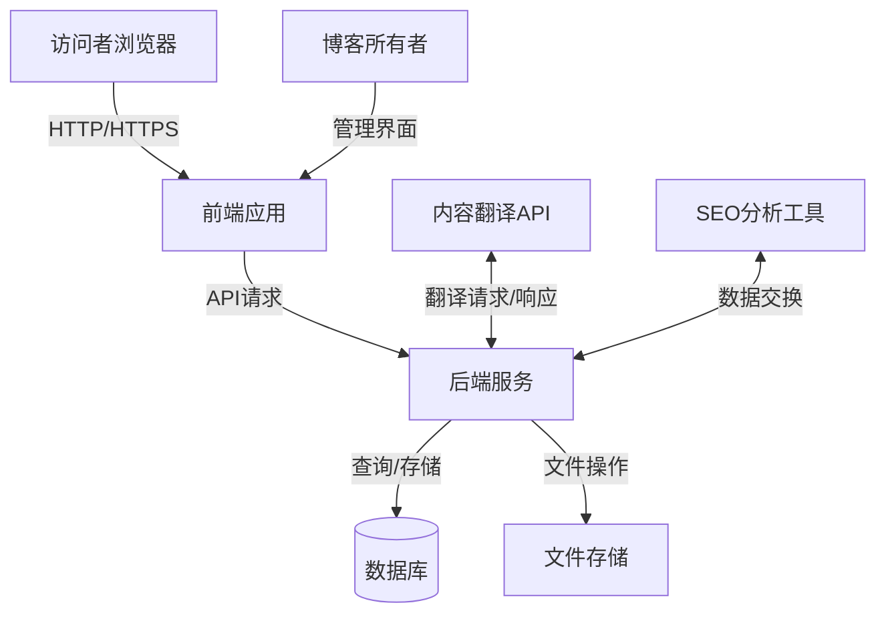
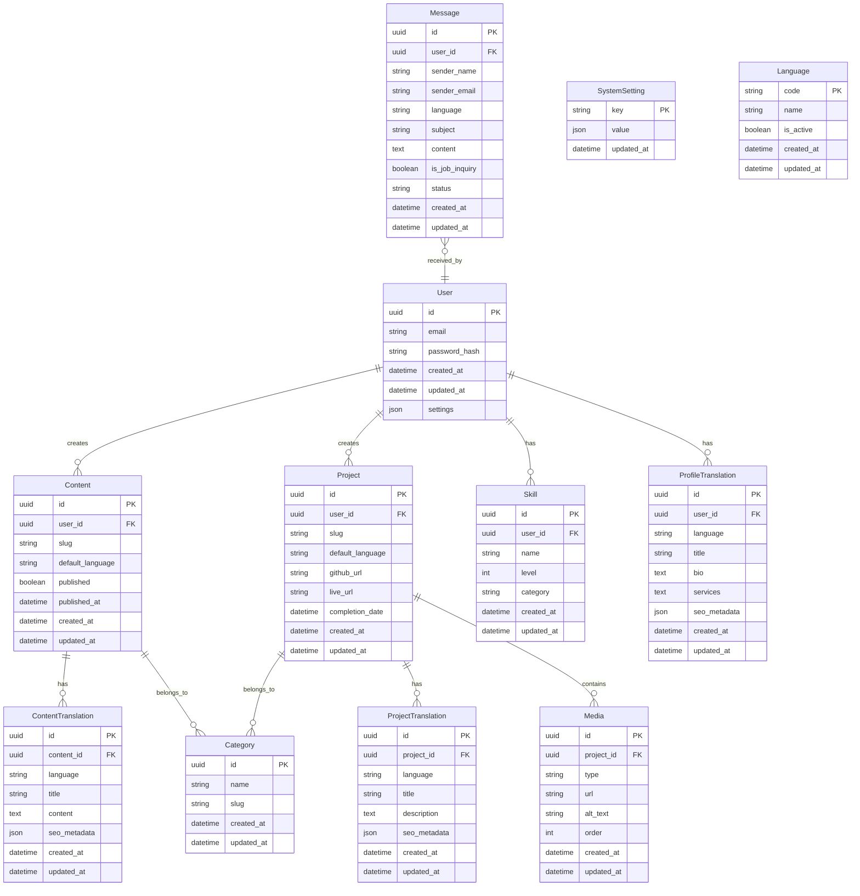

# 多语言自由职业者博客系统设计文档

## 概述

多语言自由职业者博客系统是一个为单个自由职业程序员设计的个人网站，支持多语言内容创建和展示，帮助博客所有者向全球潜在客户展示技能和项目，并接收工作邀请。本设计文档详细说明了系统的架构、组件、数据模型和实现策略。

## 架构

系统采用现代化的前后端分离架构，确保良好的性能、可维护性和可扩展性。

### 总体架构



### 技术栈选择

1. **前端**:

   - React 19 - 用于构建动态用户界面，利用最新的并发渲染特性
   - Vite - 提供快速的开发体验和构建工具
   - i18next - 处理国际化和本地化
   - TailwindCSS - 用于响应式设计和主题定制，包括内置的暗黑模式支持
   - shadcn/ui - 提供高质量 UI 组件库，与 TailwindCSS 暗黑模式无缝集成

2. **后端**:

   - Node.js + Express - 提供 API 服务
   - Prisma - ORM 工具，简化数据库操作
   - JWT - 用于身份验证和授权

3. **数据库**:

   - PostgreSQL - 主数据库，存储结构化数据
   - Redis - 缓存层，提高性能

4. **存储**:

   - AWS S3/阿里云 OSS - 存储媒体文件和备份

5. **部署**:
   - Vercel - 前端和后端 API 部署（无需 Docker）
   - PlanetScale/Railway - 托管数据库服务
   - Cloudinary/Uploadcare - 媒体文件存储
   - GitHub Actions - 自动化部署流程

## 组件和接口

### 核心组件

1. **多语言内容管理系统**

   - 负责内容的创建、编辑、翻译和发布
   - 支持多语言内容版本管理
   - 提供内容翻译状态跟踪

2. **项目展示系统**

   - 管理项目作品集
   - 支持多语言项目描述
   - 提供项目分类和筛选

3. **联系和工作邀请系统**

   - 处理访客消息和工作邀请
   - 提供消息翻译功能
   - 管理工作邀请状态

4. **个人资料管理**

   - 维护博客所有者的个人资料
   - 支持多语言个人介绍
   - 管理技能和经验展示

5. **SEO 优化模块**

   - 管理多语言 SEO 元数据
   - 生成语言特定站点地图
   - 提供 SEO 分析和建议

6. **安全和备份系统**
   - 实施安全措施
   - 执行定期备份
   - 提供数据恢复功能

### 接口设计

#### API 端点

```
/api/v1/auth
  POST /login - 博客所有者登录
  POST /logout - 退出登录
  PUT /password - 更改密码

/api/v1/content
  GET / - 获取内容列表
  GET /:id - 获取特定内容
  POST / - 创建新内容
  PUT /:id - 更新内容
  DELETE /:id - 删除内容
  GET /:id/translations - 获取内容的所有翻译版本
  POST /:id/translations - 添加内容的翻译版本

/api/v1/projects
  GET / - 获取项目列表
  GET /:id - 获取特定项目
  POST / - 创建新项目
  PUT /:id - 更新项目
  DELETE /:id - 删除项目
  POST /:id/media - 上传项目媒体

/api/v1/messages
  GET / - 获取消息列表
  GET /:id - 获取特定消息
  POST / - 创建新消息（访客联系）
  PUT /:id - 更新消息状态
  DELETE /:id - 删除消息
  POST /:id/reply - 回复消息

/api/v1/profile
  GET / - 获取个人资料
  PUT / - 更新个人资料
  POST /skills - 添加技能
  DELETE /skills/:id - 删除技能

/api/v1/settings
  GET / - 获取系统设置
  PUT / - 更新系统设置
  GET /languages - 获取支持的语言列表
  PUT /languages - 更新支持的语言

/api/v1/analytics
  GET /visitors - 获取访问统计
  GET /seo - 获取SEO分析
  GET /content-performance - 获取内容性能数据

/api/v1/backup
  POST /create - 创建备份
  GET /list - 获取备份列表
  POST /restore/:id - 恢复备份
```

#### 前端路由

```
/ - 首页
/blog - 博客文章列表
/blog/:slug - 单篇博客文章
/projects - 项目列表
/projects/:slug - 单个项目详情
/about - 关于我/个人资料
/contact - 联系表单
/admin - 管理后台（需登录）
/admin/content - 内容管理
/admin/projects - 项目管理
/admin/messages - 消息管理
/admin/profile - 个人资料管理
/admin/settings - 系统设置
/admin/analytics - 数据分析
```

## 数据模型

### 实体关系图



### 主要数据结构

#### User（用户）

存储博客所有者的账户信息。

#### Content（内容）

存储博客文章的基本信息，不包含特定语言的内容。

#### ContentTranslation（内容翻译）

存储不同语言版本的博客内容。

#### Project（项目）

存储项目的基本信息，不包含特定语言的描述。

#### ProjectTranslation（项目翻译）

存储不同语言版本的项目描述。

#### Skill（技能）

存储博客所有者的技能信息。

#### ProfileTranslation（个人资料翻译）

存储不同语言版本的个人资料。

#### Message（消息）

存储访客发送的消息和工作邀请。

#### Category（分类）

存储内容和项目的分类信息。

#### Media（媒体）

存储项目相关的图片和其他媒体文件。

#### SystemSetting（系统设置）

存储系统配置信息。

#### Language（语言）

存储系统支持的语言信息。

## 错误处理

### 错误分类

1. **验证错误**

   - 输入数据不符合要求
   - 返回 400 Bad Request 状态码和详细错误信息

2. **认证错误**

   - 未登录或登录凭证无效
   - 返回 401 Unauthorized 状态码

3. **授权错误**

   - 无权执行请求的操作
   - 返回 403 Forbidden 状态码

4. **资源错误**

   - 请求的资源不存在
   - 返回 404 Not Found 状态码

5. **服务器错误**
   - 内部服务器错误
   - 返回 500 Internal Server Error 状态码
   - 记录详细错误信息以便调试

### 错误处理策略

1. **前端错误处理**

   - 使用全局错误边界捕获 React 组件错误
   - 实现统一的 API 错误处理逻辑
   - 向用户显示友好的错误消息

2. **后端错误处理**

   - 使用中间件统一处理异常
   - 记录错误详情到日志系统
   - 返回结构化的错误响应

3. **错误监控**
   - 实现错误日志记录和报警机制
   - 定期分析错误模式以改进系统

## 测试策略

### 测试类型

1. **单元测试**

   - 测试独立组件和函数
   - 使用 Vitest 进行 JavaScript/TypeScript 代码测试
   - 使用 React Testing Library 进行组件测试
   - 目标覆盖率：80%以上

2. **集成测试**

   - 测试组件之间的交互
   - 测试 API 端点与数据库的交互
   - 使用 Supertest 测试 API

3. **端到端测试**

   - 测试完整用户流程
   - 使用 Cypress 模拟用户操作
   - 覆盖关键用户场景

4. **国际化测试**

   - 验证多语言内容正确显示
   - 测试语言切换功能
   - 检查翻译完整性

5. **性能测试**
   - 测试系统在负载下的响应时间
   - 使用 Lighthouse 评估前端性能
   - 监控 API 响应时间

### 测试自动化

1. **CI/CD 集成**

   - 在每次代码提交时运行测试
   - 阻止测试失败的代码合并
   - 自动部署通过测试的代码

2. **测试数据管理**
   - 使用工厂模式生成测试数据
   - 维护独立的测试数据库
   - 每次测试后清理测试数据

## 安全考虑

1. **身份验证与授权**

   - 使用 JWT 进行身份验证
   - 实施 RBAC（基于角色的访问控制）
   - 定期轮换密钥和令牌

2. **数据保护**

   - 加密敏感数据
   - 实施 HTTPS
   - 防止 SQL 注入和 XSS 攻击

3. **API 安全**

   - 实施速率限制
   - 验证所有输入
   - 使用 CSRF 令牌

4. **备份与恢复**

   - 定期自动备份
   - 加密备份数据
   - 测试恢复流程

5. **合规性**
   - 实施必要的隐私政策
   - 遵守 GDPR 等相关法规
   - 提供数据导出功能

## 部署与 DevOps

1. **环境配置**

   - 开发环境
   - 测试环境
   - 生产环境

2. **CI/CD 流程**

   - 使用 GitHub Actions 自动化构建和部署
   - 实施蓝绿部署策略
   - 自动化测试和质量检查

3. **监控与日志**

   - 使用 ELK 栈收集和分析日志
   - 实施应用性能监控
   - 设置关键指标的警报

4. **扩展策略**
   - 使用 CDN 分发静态资源
   - 实施缓存策略
   - 准备水平扩展方案

## 实施计划

采用渐进式开发方法，优先实现核心功能，逐步添加高级特性。每个阶段都会产出可用的功能，确保系统始终处于可用状态。

### 阶段一：最小可行产品 (MVP)

1. **基础设置与框架搭建**

   - 使用 pnpm 创建 Vite+React 项目，配置 TypeScript
   - 使用 pnpm 安装并设置 TailwindCSS 和 shadcn/ui 组件库
   - 利用 TailwindCSS 和 shadcn/ui 内置功能实现暗黑模式支持
   - 配置基本的 i18next 国际化框架

2. **基础多语言博客功能**

   - 实现简单的博客文章列表和详情页
   - 添加语言切换功能
   - 创建基本的管理员登录功能
   - 实现简单的内容编辑功能

3. **部署基础版本**
   - 设置 Vercel 部署
   - 配置基本数据库连接
   - 确保基本功能在生产环境正常工作

### 阶段二：核心功能增强

1. **完善多语言内容管理**

   - 实现完整的内容创建和编辑流程
   - 添加多语言内容版本管理
   - 实现内容翻译状态跟踪
   - 添加内容分类和标签功能

2. **项目展示功能**

   - 创建项目展示页面
   - 实现项目详情页
   - 添加多语言项目描述
   - 实现项目筛选功能

3. **个人资料管理**
   - 创建"关于我"页面
   - 实现技能展示功能
   - 添加多语言个人介绍
   - 实现简单的个人资料编辑功能

### 阶段三：用户交互功能

1. **联系和工作邀请系统**

   - 实现联系表单
   - 添加邮件通知功能
   - 创建消息管理界面
   - 实现简单的消息翻译功能

2. **用户体验优化**
   - 改进响应式设计
   - 优化页面加载性能
   - 添加动画和过渡效果
   - 实现更好的错误处理和用户反馈

### 阶段四：高级功能与优化

1. **SEO 优化功能**

   - 实现多语言 SEO 元数据管理
   - 添加自动站点地图生成
   - 实现结构化数据标记
   - 添加基本的分析功能

2. **安全和备份功能**

   - 增强身份验证和授权
   - 实现自动备份功能
   - 添加数据恢复选项
   - 实施更多安全最佳实践

3. **性能优化**
   - 实现高级缓存策略
   - 优化图片和资源加载
   - 改进数据库查询性能
   - 实施代码分割和懒加载

### 阶段五：扩展与集成

1. **第三方服务集成**

   - 添加社交媒体分享功能
   - 集成自动翻译 API
   - 添加高级分析工具
   - 实现更多第三方服务集成

2. **持续改进**
   - 基于用户反馈进行功能调整
   - 添加新的语言支持
   - 实现更多自定义选项
   - 持续优化性能和用户体验

## 未来扩展

1. **内容自动翻译**

   - 集成机器翻译 API
   - 实现一键翻译功能

2. **高级分析**

   - 实现更详细的访问统计
   - 添加内容性能分析

3. **集成更多第三方服务**

   - 社交媒体集成
   - 支付系统（用于接受客户付款）

4. **移动应用**
   - 开发配套移动应用
   - 实现推送通知
